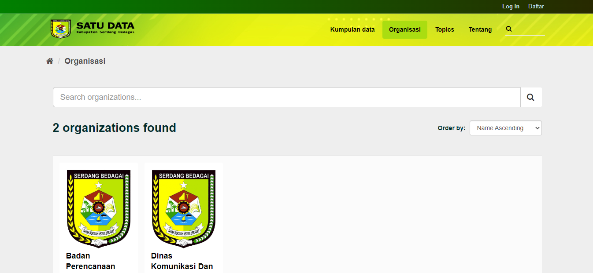

### Halaman Depan

# ckanext-sergai_theme

### Halaman Dataset

### Halaman Organisasi

# Cara Install:

- salin file zip ke `/usr/lib/ckan/default/src`
- cd `/usr/lib/ckan/default/src`
- Jalankan `python setup.py install`
- Setelah ini berhasil diselesaikan, tambahkan `sergai_theme` ke ckan.plugins di file konfigurasi ckan.

## Manual generating main.css

---

Jalankan `sass ckanext/sergai_theme/public/css/sass/main.scss ckanext/sergai_theme/public/css/main.css`
